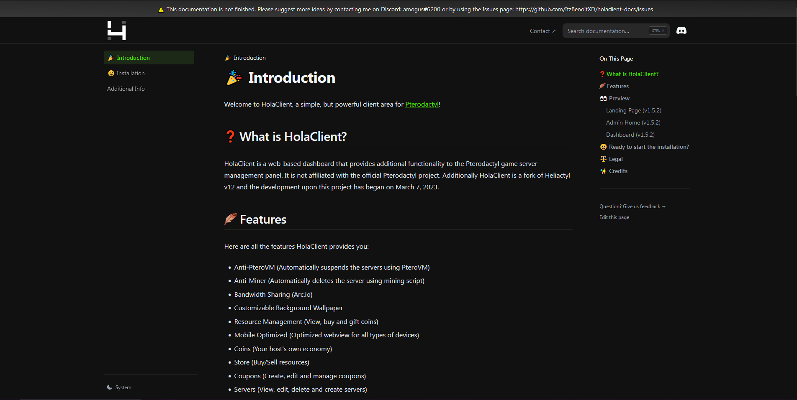

<br/>
<p align="center">
  <a href="https://github.com/ItzBenoitXD/holaclient-docs">
    
  </a>

  <h3 align="center">HolaClient's New Documentation</h3>

  <p align="center">
    The (new) HolaClient's new documentation. Powered by Nextra, hosted on Vercel.
    <br/>
    <br/>
    <a href="https://docs.holaclient.tech"><strong>Explore the docs »</strong></a>
    <br/>
    <br/>
    <a href="https://docs.holaclient.tech">View Demo</a>
    .
    <a href="https://github.com/ItzBenoitXD/holaclient-docs/issues">Report Bug</a>
    .
    <a href="https://github.com/ItzBenoitXD/holaclient-docs/issues">Request Feature</a>
  </p>
</p>

     

## 📜 Table of Contents

* [About the Project](#about-the-project)
* [Built With](#built-with)
* [Getting Started](#getting-started)
  * [Prerequisites](#prerequisites)
  * [Installation](#installation)
* [Usage](#usage)
* [Roadmap](#roadmap)
* [Contributing](#contributing)
* [License](#license)
* [Authors](#authors)
* [Acknowledgements](#acknowledgements)

## ❓ About the Project



The new documentation made by @ItzBenoitXD along with current contributors to replace the old (and not open-source) documentation using [Next.js](https://nextjs.org), used by some of the world's largest companies, Next.js enables you to create full-stack Web applications by extending the latest React features, and integrating powerful Rust-based JavaScript tooling for the fastest builds. This documentation has been based out of [Nextra's](https://nextra.site) [Docs theme](https://github.com/shuding/nextra-docs-template), a simple, powerful and flexible site generation framework with everything you love from Next.js.

## 🛠 Built with

* [Next.js](https://nextjs.org) 
with the help of 
* [Nextra](https://nextra.site) 
* [Nextra's Docs Theme](https://github.com/shuding/nextra-docs-template)

## ✅ Getting Started

To get a local instance (and possibly contribute) of the documentation, it's pretty easy.

### Prerequisites

You will need:

* pnpm

```sh
npm install -g pnpm
```

* npm (to update pnpm)

```
npm install npm@latest -g
```

* node.js

Get it here: https://nodejs.org/en

* git

Get it here: https://git-scm.com/

### Installation

1. Get all the requirements installed on your computer.

2. Clone the repository:

```sh
git clone https://github.com/ItzBenoitXD/holaclient-docs.git
```

3. Install ALL packages using pnpm:

```sh
pnpm install
```

4. Launch the development server:

```sh
pnpm dev
```

## ⁉ Usage

This documentation can be used to host a local copy of the documentation to contribute, to... i don't know.

## 🕷️ Roadmap

See the [open issues](https://github.com/ItzBenoitXD/holaclient-docs/issues) for a list of proposed features (and known issues).

## Contributing

Contributions are what make the open source community such an amazing place to be learn, inspire, and create. Any contributions you make are **greatly appreciated**.
* If you have suggestions for adding or removing projects, feel free to [open an issue](https://github.com/ItzBenoitXD/holaclient-docs/issues/new) to discuss it, or directly create a pull request after you edit the *README.md* file with necessary changes.
* Please make sure you check your spelling and grammar.
* Create individual PR for each suggestion.
* Please also read through the [Code Of Conduct](https://github.com/ItzBenoitXD/holaclient-docs/blob/main/CODE_OF_CONDUCT.md) before posting your first idea as well.

### Creating a Pull Request

1. [Fork the repository](https://github.com/ItzBenoitXD/holaclient-docs/fork)
2. Create your feature branch (`git checkout -b feature/AmazingFeature`)
3. Commit your changes (`git commit -m 'Add some AmazingFeature'`)
4. Push to the branch (`git push origin feature/AmazingFeature`)
5. Open a Pull Request

## License

Distributed under the MIT License. See [LICENSE](https://github.com/ItzBenoitXD/holaclient-docs/blob/main/LICENSE.md) for more information.

## Authors

* **Shaan Khan** - *Comp Sci Student* - [Shaan Khan](https://github.com/ShaanCoding/) - *Built ReadME Template (big thanks)*
* **ItzBenoitXD** - *Manager in @stozu* - [ItzBenoitXD](https://github.com/ItzBenoitXD) - *Made the new documentation*
* **CR072** - [CR072](https://github.com/CR072) - *Made HolaClient and the old documentation*

## Acknowledgements

* [ItzBenoitXD](https://github.com/ItzBenoitXD)
* [CR072](https://github.com/CR072)
* [ImgShields](https://shields.io/)
